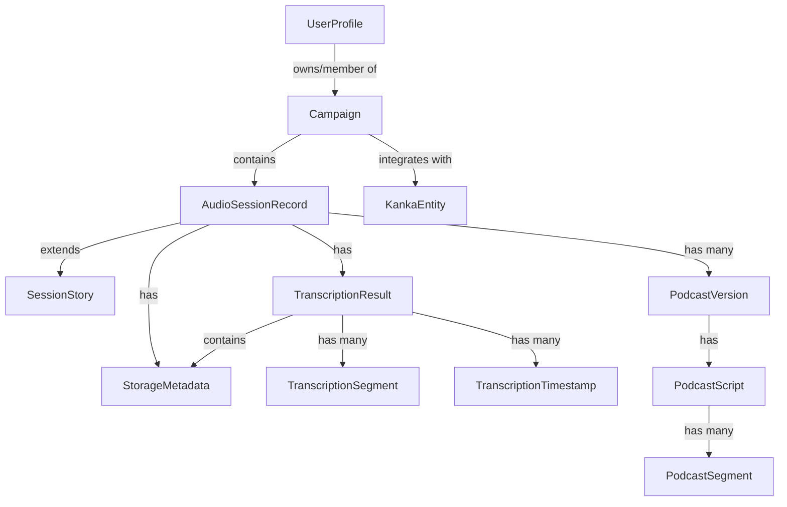
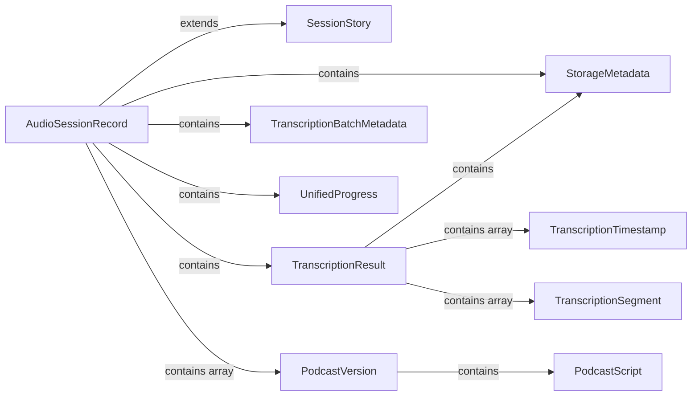
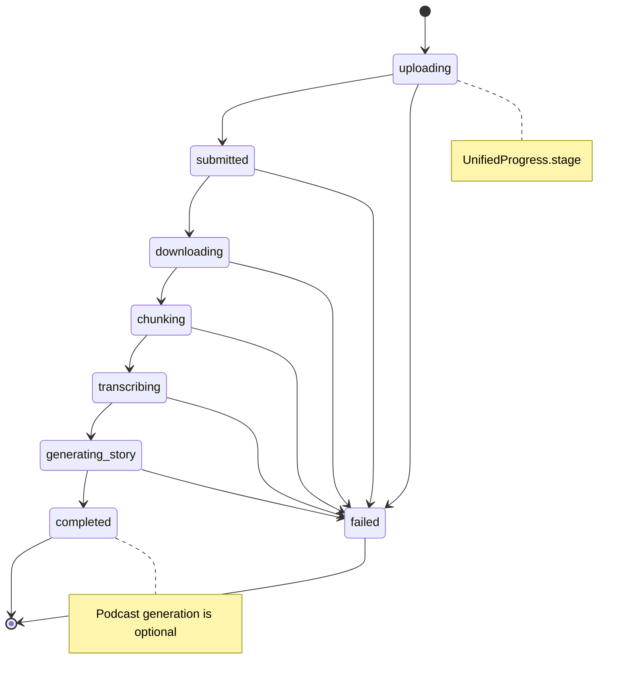

# QuestMind Data Layer Analysis

## Overview

This document provides a comprehensive analysis of the QuestMind data layer, including all interfaces, their relationships, and identified duplicate/redundant fields that should be cleaned up.

**Generated:** 2026-02-07

---

## Database Structure

### Firestore Collections

```
firestore
├── users/{uid}                                    (UserProfile)
├── campaigns/{campaignId}                         (Campaign)
│   └── audioSessions/{sessionId}                  (AudioSessionRecord)
└── settings/ai                                    (AiSettings)
```

---

## Data Model Visualization

### Core Entity Relationships



### AudioSessionRecord Composition



### Processing Pipeline Flow



---

## Interface Definitions

### User & Campaign Models

#### UserProfile (TWO VERSIONS - DUPLICATE!)

**Version 1:** `/src/app/campaign/campaign.models.ts`
```typescript
interface UserProfile {
  uid: string;
  email: string;
  displayName?: string;
  photoURL?: string;              // Only in this version
  campaigns: string[];
  defaultCampaignId?: string;
  updatedAt?: string;
  createdAt?: string;
}
```

**Version 2:** `/src/app/core/user.service.ts`
```typescript
interface UserProfile {
  uid: string;
  email: string | null;           // Nullable in this version
  displayName: string | null;     // Nullable in this version
  admin?: boolean;                // Only in this version
  campaigns?: string[];           // Optional in this version
  createdAt?: Date;               // Date type instead of string
  updatedAt?: Date;               // Date type instead of string
}
```

#### Campaign

```typescript
interface Campaign {
  id: string;
  name: string;
  description?: string;
  createdAt: string;
  updatedAt: string;
  ownerId: string;
  ownerEmail: string;
  members: Record<string, CampaignMember>;
  settings?: CampaignSettings;
}
```

#### CampaignMember

```typescript
interface CampaignMember {
  role: 'owner' | 'member';
  email: string;
  joinedAt: string;
}
```

#### CampaignSettings

```typescript
interface CampaignSettings {
  allowMembersToCreateSessions: boolean;
  kankaEnabled?: boolean;
  kankaCampaignId?: string;
}
```

---

### Audio Session Models

#### AudioSessionRecord (MAIN ENTITY - MANY DUPLICATES)

```typescript
interface AudioSessionRecord extends SessionStory {
  // Ownership & Campaign
  campaignId: string;
  ownerId: string;
  ownerEmail: string;
  createdBy: string;

  // Status
  status: 'uploading' | 'processing' | 'completed' | 'failed';
  updatedAt: string;

  // Transcription (nested object)
  transcription?: TranscriptionResult;

  // Storage (nested object)
  storageMetadata?: StorageMetadata;

  // DUPLICATE: Storage fields (also in storageMetadata)
  storagePath?: string;                    // DUPLICATE of storageMetadata.storagePath
  audioFileName?: string;                  // DUPLICATE of SessionStory.audioFileName
  audioFileSize?: number;                  // DUPLICATE of fileSize
  fileSize?: number;                       // DUPLICATE of storageMetadata.fileSize/sizeBytes
  contentType?: string;                    // DUPLICATE of storageMetadata.contentType

  // Transcription management
  activeTranscriptionId?: string;
  transcriptions?: TranscriptionRecord[];

  // User corrections
  userCorrections?: string;
  correctionsUpdatedAt?: string;

  // Story regeneration tracking
  storyRegeneratedAt?: string;
  storyRegenerationCount?: number;

  // Podcast
  podcasts?: PodcastVersion[];
  latestPodcastVersion?: number;

  // DUPLICATE: Batch transcription fields (also in transcription.*)
  transcriptionText?: string;              // DUPLICATE of transcription.rawTranscript
  timestamps?: TranscriptionTimestamp[];   // DUPLICATE of transcription.timestamps
  transcriptionSegments?: TranscriptionSegment[]; // DUPLICATE of transcription.segments
  transcriptionCompletedAt?: string;

  // DUPLICATE: Story content (also from SessionStory.content)
  storyContent?: string;                   // DUPLICATE of SessionStory.content
  storyGeneratedAt?: string;

  // Batch job tracking
  transcriptionBatch?: TranscriptionBatchMetadata;

  // New unified progress (worker chain)
  progress?: UnifiedProgress;

  // DUPLICATE: Legacy progress fields
  completeProcessingStatus?: CompleteProcessingStatus;     // LEGACY
  completeProcessingProgress?: number;                     // LEGACY
  completeProcessingMessage?: string;                      // LEGACY
  completeProcessingError?: string;                        // LEGACY

  // Model tracking
  modelsUsed?: {
    transcription?: string;
    storyGeneration?: string;
    podcastScript?: string;
  };

  // Processing metadata
  processingStartedAt?: string;
  processingCompletedAt?: string;
  processingDurationMs?: number;
}
```

#### SessionStory (Extended by AudioSessionRecord)

```typescript
interface SessionStory {
  id: string;
  title: string;
  content: string;                         // Story content
  sessionDate?: string;
  audioFileName?: string;
  storageUrl: string;                      // DUPLICATE of storageMetadata.downloadUrl
  createdAt: string;
}
```

#### StorageMetadata

```typescript
interface StorageMetadata {
  sessionId: string;                       // DUPLICATE of AudioSessionRecord.id
  campaignId: string;                      // DUPLICATE of AudioSessionRecord.campaignId
  storagePath: string;
  downloadUrl: string;                     // DUPLICATE of SessionStory.storageUrl
  fileSize: number;
  contentType: string;
  uploadedAt: string;
  durationSeconds?: number;
  sizeBytes?: number;                      // DUPLICATE of fileSize
}
```

#### TranscriptionResult

```typescript
interface TranscriptionResult {
  id: string;                              // DUPLICATE of sessionId
  rawTranscript: string;
  timestamps: TranscriptionTimestamp[];
  status: 'processing' | 'completed' | 'failed';
  storageMetadata: StorageMetadata;        // DUPLICATE nesting
  segments?: TranscriptionSegment[];
  durationSeconds?: number;                // DUPLICATE of storageMetadata.durationSeconds
}
```

#### TranscriptionRecord

```typescript
interface TranscriptionRecord {
  id: string;
  sessionId: string;
  rawTranscript: string;
  timestamps: TranscriptionTimestamp[];
  status: 'processing' | 'completed' | 'failed';
  createdAt: string;
  label?: string;
  isComplete?: boolean;
  completedChunks?: number;
  totalChunks?: number;
  lastProcessedChunkIndex?: number;
  chunks?: TranscriptionChunk[];
}
```

#### TranscriptionSegment

```typescript
interface TranscriptionSegment {
  timeSeconds: number;
  text: string;
  speaker?: string;
}
```

#### TranscriptionTimestamp

```typescript
interface TranscriptionTimestamp {
  time: number;
  text: string;
}
```

#### TranscriptionChunk

```typescript
interface TranscriptionChunk {
  index: number;
  startTimeSeconds: number;
  endTimeSeconds: number;
  durationSeconds: number;
  status: 'pending' | 'processing' | 'completed' | 'failed';
  segments?: TranscriptionSegment[];
  completedAt?: Date;
  error?: string;
  failedAt?: Date;
  retryCount?: number;
  tokensUsed?: number;
  thoughtsTokens?: number;
  processingTimeMs?: number;
}
```

---

### Progress Tracking Models

#### UnifiedProgress (NEW - Worker Chain Architecture)

```typescript
interface UnifiedProgress {
  stage: ProgressStage;                    // Current worker stage
  progress: number;                        // 0-100 percentage
  currentStep?: string;
  failure?: ProgressFailure;
  updatedAt: Date;
}

type ProgressStage =
  | 'uploading'
  | 'submitted'
  | 'downloading'
  | 'chunking'
  | 'transcribing'
  | 'generating-story'
  | 'completed'
  | 'failed';
```

#### ProcessingProgress (LEGACY - For Backward Compatibility)

```typescript
interface ProcessingProgress {
  status: CompleteProcessingStatus;
  progress: number;
  message: string;
  error?: string;
}

type CompleteProcessingStatus =
  | 'idle'
  | 'loading_context'
  | 'transcribing'
  | 'transcription_complete'
  | 'generating_story'
  | 'story_complete'
  | 'generating_script'
  | 'script_complete'
  | 'generating_audio'
  | 'uploading'
  | 'completed'
  | 'failed';
```

#### ProgressFailure

```typescript
interface ProgressFailure {
  stage: string;
  error: string;
  timestamp: Date;
  details?: any;
}
```

---

### Podcast Models

#### PodcastVersion

```typescript
interface PodcastVersion {
  version: number;
  createdAt: Date;
  scriptGeneratedAt?: Date;
  audioGeneratedAt?: Date;
  audioUrl?: string;
  duration?: number;                       // seconds
  fileSize?: number;                       // bytes
  storyVersion?: number;
  script?: PodcastScript;

  // Enhanced progress tracking
  status: 'pending' | 'loading_context' | 'generating_script'
    | 'script_complete' | 'generating_audio' | 'uploading'
    | 'completed' | 'failed';
  progress: number;                        // 0-100
  progressMessage: string;
  error?: string;

  // Model tracking
  modelUsed?: string;
}
```

#### PodcastScript

```typescript
interface PodcastScript {
  segments: PodcastSegment[];
  estimatedDuration: number;               // seconds
}
```

#### PodcastSegment

```typescript
interface PodcastSegment {
  speaker: 'host1' | 'host2';
  text: string;
  emotion?: 'neutral' | 'excited' | 'curious' | 'amused';
}
```

---

### Kanka Integration Models

#### KankaEntity

```typescript
interface KankaEntity {
  id: number;
  name: string;
  type: string;
  entry?: string;
  entry_parsed?: string;
  tags?: Array<{ id: number; name: string }>;
  image?: string;
  is_private?: boolean;
}

type KankaEntityType = 'characters' | 'locations' | 'quests' | 'organisations';
```

#### KankaSearchResult

```typescript
interface KankaSearchResult {
  characters: KankaEntity[];
  locations: KankaEntity[];
  quests: KankaEntity[];
  organisations: KankaEntity[];
}
```

---

### Admin Settings Models

#### AiSettings

```typescript
interface AiSettings {
  features: {
    transcription: {
      model: string;
      temperature: number;
      topP: number;
      topK: number;
      maxOutputTokens: number;
    };
    storyGeneration: {
      model: string;
      temperature: number;
      topP: number;
      topK: number;
      maxOutputTokens: number;
    };
    podcastScript: {
      model: string;
      temperature: number;
      topP: number;
      topK: number;
      maxOutputTokens: number;
    };
    podcastVoices: PodcastVoiceSettings;
  };
}
```

#### PodcastVoiceSettings

```typescript
interface PodcastVoiceSettings {
  host1VoiceId: string;
  host2VoiceId: string;
}
```

---

## Identified Duplicate & Redundant Fields

### 🔴 Critical Duplicates (High Priority)

#### 1. UserProfile Interface Duplication

**Problem:** Two different `UserProfile` interfaces in different files with incompatible fields.

**Locations:**
- `/src/app/campaign/campaign.models.ts` (has `photoURL`)
- `/src/app/core/user.service.ts` (has `admin`, nullable types)

**Fields:**
| Field | campaign.models.ts | user.service.ts |
|-------|-------------------|-----------------|
| `uid` | `string` | `string` |
| `email` | `string` | `string \| null` |
| `displayName` | `string \| undefined` | `string \| null \| undefined` |
| `photoURL` | ✅ | ❌ |
| `admin` | ❌ | ✅ |
| `campaigns` | `string[]` | `string[] \| undefined` |
| `createdAt` | `string \| undefined` | `Date \| undefined` |
| `updatedAt` | `string \| undefined` | `Date \| undefined` |

**Recommendation:** Merge into single interface with all fields.

---

#### 2. File Size Fields (AudioSessionRecord)

**Duplicate fields storing the same data:**
- `audioFileSize` (number)
- `fileSize` (number)
- `storageMetadata.fileSize` (number)
- `storageMetadata.sizeBytes` (number)

**Recommendation:** Keep only `storageMetadata.fileSize`, remove all others.

---

#### 3. Storage URL Fields

**Duplicate fields:**
- `storageUrl` (from SessionStory inheritance)
- `storageMetadata.downloadUrl`

**Recommendation:** Keep only `storageMetadata.downloadUrl`, remove `storageUrl` from SessionStory or make it a computed getter.

---

#### 4. Storage Path Fields

**Duplicate fields:**
- `storagePath`
- `storageMetadata.storagePath`

**Recommendation:** Keep only `storageMetadata.storagePath`.

---

#### 5. Audio Duration Fields

**Duplicate fields:**
- `storageMetadata.durationSeconds`
- `transcription.durationSeconds`

**Recommendation:** Keep only `storageMetadata.durationSeconds` as source of truth.

---

#### 6. Transcription Text/Content Fields

**Duplicate fields:**
- `transcriptionText` (flat field)
- `transcription.rawTranscript` (nested)

**Recommendation:** Keep only `transcription.rawTranscript`.

---

#### 7. Transcription Timestamps Fields

**Duplicate fields:**
- `timestamps` (flat array)
- `transcription.timestamps` (nested array)

**Recommendation:** Keep only `transcription.timestamps`.

---

#### 8. Transcription Segments Fields

**Duplicate fields:**
- `transcriptionSegments` (flat array)
- `transcription.segments` (nested array)

**Recommendation:** Keep only `transcription.segments`.

---

#### 9. Story Content Fields

**Duplicate fields:**
- `content` (from SessionStory)
- `storyContent`

**Recommendation:** Keep only `content` from SessionStory or rename for clarity.

---

#### 10. Session/Document ID Fields

**Duplicate fields:**
- `id` (from SessionStory)
- `transcription.id`
- `transcription.storageMetadata.sessionId`

**Recommendation:** Use document ID, remove redundant nested IDs.

---

### 🟡 Legacy Fields (Medium Priority)

#### 11. Legacy Processing Progress Fields

**Legacy fields (should be removed after migration to UnifiedProgress):**
- `completeProcessingStatus`
- `completeProcessingProgress`
- `completeProcessingMessage`
- `completeProcessingError`

**Current field:**
- `progress` (UnifiedProgress)

**Recommendation:** Remove all legacy fields once migration is complete. These were from "Ticket 35" and replaced by worker chain architecture in "Ticket 36".

---

### 🟢 Questionable Duplicates (Low Priority)

#### 12. Content Type Field

**Duplicate fields:**
- `contentType` (flat field)
- `storageMetadata.contentType`

**Recommendation:** Keep only `storageMetadata.contentType`.

---

#### 13. Audio Filename Field

**Duplicate fields:**
- `audioFileName` (from SessionStory)
- `audioFileName` (duplicate in AudioSessionRecord)

**Note:** This appears twice because AudioSessionRecord extends SessionStory and also declares it.

**Recommendation:** Remove explicit declaration from AudioSessionRecord, rely on inheritance.

---

#### 14. Campaign/Owner ID in Nested Objects

**Duplicate fields:**
- `campaignId` (root)
- `storageMetadata.campaignId` (nested)

**Recommendation:** Keep only root-level `campaignId`.

---

## Summary Statistics

### Total Identified Issues

| Category | Count |
|----------|-------|
| Critical Duplicates | 10 |
| Legacy Fields | 4 |
| Questionable Duplicates | 4 |
| **Total Issues** | **18** |

### Fields by Source File

| File | Interfaces | Total Fields |
|------|-----------|--------------|
| `audio-session.models.ts` | 16 | ~120 fields |
| `campaign.models.ts` | 4 | ~20 fields |
| `user.service.ts` | 1 | ~7 fields |
| `kanka.models.ts` | 4 | ~15 fields |
| `admin.component.ts` | 2 | ~15 fields |

---

## Recommendations

### Phase 1: Critical Cleanup (Do First)

1. **Merge UserProfile interfaces** into single source of truth
2. **Remove file size duplicates** - keep only `storageMetadata.fileSize`
3. **Remove transcription duplicates** - keep only nested `transcription.*` fields
4. **Remove storage duplicates** - keep only `storageMetadata.*` fields

### Phase 2: Legacy Removal (After Testing)

5. **Remove legacy progress fields** once UnifiedProgress is fully deployed
6. **Remove CompleteProcessingStatus type** (legacy)
7. **Remove ProcessingProgress interface** (legacy)

### Phase 3: Optimization (Optional)

8. Consider flattening some nested structures if they're always accessed together
9. Add TypeScript mapped types for better type safety
10. Consider adding Zod or similar runtime validation

---

## Migration Notes

When cleaning up these duplicates:

1. **Check backend functions** - ensure Cloud Functions aren't relying on flat fields
2. **Update queries** - Firestore queries may filter on these fields
3. **Update UI components** - ensure all components use the canonical fields
4. **Migration script** - write a Firestore migration to remove deprecated fields from existing documents
5. **Backward compatibility** - consider keeping read support for old fields during transition

---

**End of Analysis**
